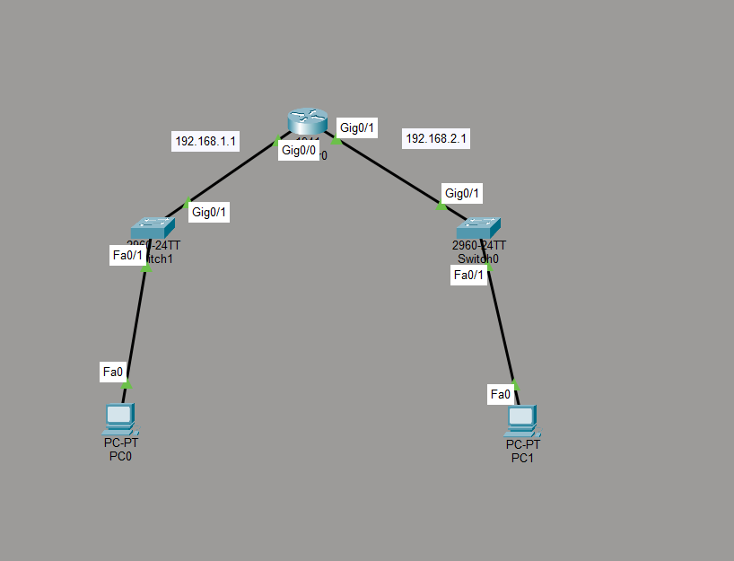

# Basic routing & Default gateway lab

## 📌 Project Purpose
This Project demonstrates communication between two different subnets using a router default gateways.

## 🖥 Topology

## 🌐 Network Design
### Subnet 1
- Network: 192.168.1.0/24
- Router Interface: 192.168.1.1
- PC0: 192.168.1.5
- Default Gateway: 192.168.1.1

### Subnet 2
- Network: 192.168.2.0/24
- Router Interface: 192.168.2.1
- PC1: 192.168.2.7
- Default Gateway: 192.168.2.1

## ⚙ Router Configuration
enable
configure terminal
interface g0/0
ip address 192.168.1.1 255.255.255.0
no shutdown

interface g0/1
ip address 192.168.2.1 255.255.255.0
no shutdown

## ✅ Testing

PC0 successfully pings PC1.
ping 192.168.2.7

## 🎯 What I Learned
-Difference between switch and router
-How default gateway works
-Inter-subnet communication
-Basic router configuration

